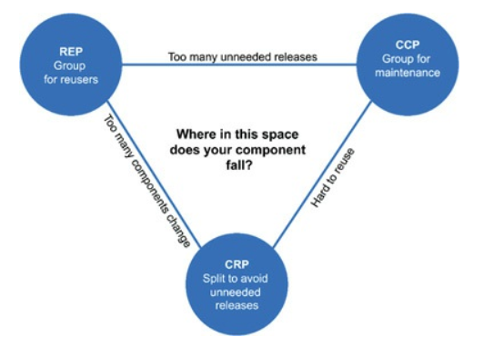

# Modularizáció

## Ajánlott irodalom

* Robert C. Martin: Clean Architecture
* Java Application Architecture

## Clean architecture

* Objektumorientált alapelveket alkalmazza magasabb absztrakciós szinten (modul, vagy az ő szóhasználatában komponens)
	* Az alapelveket, a döntések miértjét mindenképpen érdemes ismerni
	* A választott megoldás nem elterjedt, a klasszikus 3-rétegű architektúrához képest
			szignifikáns eltérés van

### Architektúra fogalma

* Tervezési döntések
* Jellemzője, hogy mindig kevesebbet tudunk, mint amennyi a döntéshez szükséges lenne
* Megoldás: döntés elhalasztásának elve
* Ennek feltétele, ha a felkészülünk a változásra
* Architektúra célja: legkevesebb emberi erőforrásból elkészíteni és karbantartani a szoftvert
* Architekt: egy jó programozó, aki a programozási feladatain felül a csapatát a megfelelő tervezési döntésekkel a maximális hatékonyság felé tereli
* Új igény nem feltétlen illik bele az architektúrába: módosítást igényel
	* Egyik legerőforrásigényesebb, megtalálni a bővítési pontot

### Polimorfizmus

* Dependency inversion (S.O.L.I.D. elvek D betűje) - polimorfizmus teszi lehetővé
* A függőség megfordítható a program folyásával ellenkező irányba (hívási lánc)
* Architektúra szempontjából nagyon fontos

### Dependency inversion

### Component principles

* Component: külön deployolható (jar - Java, dll - .NET)
* S.O.L.I.D. elvek alkalmazása komponenseknél is
* Milyen osztályok kerüljenek azonos komponensbe, és milyen osztályok külön
* Külső referenciák - ezek feloldása
    * Linkelés vagy dinamikusan betöltés
* Elvek:
    * REP - Reuse/release equivalence principle - újrafelhasználás és release tárgya ugyanaz
    * CCP - Common closure principle - a komponens azokat az osztályokat gyűjtse össze, melyek azonos okból változhatnak
    * CRP - Common reuse principleCommon reuse principle - komponens használóját ne kényszerítsük további felesleges függőségekre

### Reuse/release equivalence principle

* Újrafelhasználás és release tárgya ugyanaz
* OO ígéretét teljesíti be
* Függőség kezelés (Maven - Java, NuGet - .NET)
* Újrafelhasználás granularitása megegyezik a release granularitásával
	* Kell egy tárgy/téma, ami összefogja
* Release: verziószám
	* Semantic versioning

### Common closure principle

* A komponens azokat az osztályokat gyűjtse össze, melyek azonos okból változhatnak
* Hiszen ha többet kell, akkor többet kell tesztelni, release-elni, telepíteni, stb.
* SRP megfelelője

### Common reuse principle

* Komponens használóját ne kényszerítsük további felesleges függőségekre
* Összefüggő osztályok azonos komponensben, de a nem összefüggőek külön
* Interface segregation principle megfelelője
* Tranzitív függések
	* Nem kell feltétlen minden belőle
	* Több kisebb
	* Opcionális legyen

### Cohesion tension diagram

Időközben változhatnak a fontosságok, fejleszthetőségről az újrafelhasználás felé

### Komponensek közötti kapcsolatok

* Komponens struktúra nehezen tervezhető meg az elején top-down módon - inkább dinamikusan alakuljon
* Külön komponens, külön csapat - lsd. Conway törvénye
* Különböző csapatok egymásra hatásának csökkentése
* Időbeli eltolás
	* Használó csapat eldöntheti a verziószám változtatásával, hogy mikor integrálja az új release-t
	* Integráció kis lépésekben
* Nagy szerepe a CI-nek

### Komponensek közötti kapcsolatokra vonatkozó elvek

* ADP - Acyclic dependencies principle - ne legyen körkörös kapcsolat
* SDP - Stable Dependencies Principle - a dinamikusan változó komponensek függjenek a stabil komponenseken
* SAP - Stable Abstractions Principle - egy komponens annyira legyen absztrakt, mint amennyire stabil

### Acyclic dependencies principle

* Tyúk vagy a tojás probléma a buildnél
* Feloldás:
	* Dependency inversion
	* Harmadik bevezetése, melyen mindkettő függ

### Stable Dependencies Principle

* Nehezen módosítható komponens ne függjön gyorsan változó komponensen
* Nagyon nehezen módosítható az a komponens, melyen sokan függenek
* Stabil modulokra kell építeni az erősebben változókat
* Tartalmazhat csak interfészeket, ha az implementáció erősen változik

### Stable Abstractions Principle

* Amennyiben absztrakt, módosítás nélkül is kiterjeszthető

### Zones of exclusion

* I (Instability) = kimenő függőségek száma / összes
* A (Abstractness) = absztrakt osztályok és interfészek száma / összes
* X tengely: absztrakt és stabil
* Y tengely: konkrét és instabil

### Kerülendő

* Pain: stabil és konkrét
	* Nehezen bővíthető
	* Példák
		* Library, pl. `String`
		* Adatbázis séma
* Uselessness: instabil és absztrakt
	* Nincsenek függőségei
	* Sehol nem implementált interfészek és absztrakt osztályok

### Döntés elhalasztásának az elve

* Nem kell korán DB gyártót választani
* Nem kell korán felületi technológiát választani
* REST-t API-t nem kell kitalálni
* Nem kell DI keretrendszert választani
* Ha már a döntés megszületett, akkor is kezeljük, mintha nem
* Minél később döntünk, annál több információ áll a rendelkezésünkre

### Architektúrának támogatnia kell

* Funkcionális követelmények: sokat nem befolyásol, de meg kell jelennie az architektúrában
* Operation: ide tartozik pl. a terhelhetőség, felhasználószám, válaszidő, stb.
* Development: különálló csapatok párhuzamos munkája
* Deployment: lsd. Continuous Deployment

### Komponensekbe szervezés

* Üzleti logika, adatbázis, UI - horizontal layers
* Funkcionalitás  szerint - vertical layers
* Komponensek elválasztásának módja
	* Csomag/névtér szinten (source level)
	* In-process, de külön deployment/release (deployment level - JAR, DLL)
	* Külön process (service level)
* Továbblépés a SOA vagy microservices felé
* Kezdetben legyen egyben, de le lehessen módosítani
	* Mérés alapján, hiszen előre nem gondolhatjuk, mit kell külön skálázni
	* Minden irányba, microservice-eket később egybe is olvaszthatunk
	* Klasszikus rossz példa: külön szervereken futó három réteg, hálózati kommunikációval
		* Egy mező bevezetése rengeteg plusz munkával jár

### Duplikálás

* Példa: két nagyon hasonló CRUD képernyő, különálló entitásokon
* Ami külön változik, külön legyen
* Ezen képernyőknek különböző lesz az életútja
* Duplikálás megengedhető
* Felesleges absztrakció közös részeket kiemelni
* Tilos pl. ugyanazt az entitást használni különböző rétegek között, különböző képernyőkön, in/out paraméterként
	* Ismétlés van
	* Másolást végző library-k

### Elsődleges cél: boundary

* Architektúra: komponensek és határok
* Draw the lines
* Plugin architektúra
	* Aszimetrikus viszony, a pluginről nem tud a plugin futtatója
* A vonal két oldalán álló komponensek más miatt, és időben másképp változnak
* Magas szintű komponenseken függnek az alacsony szintű komponensek

### Tesztek

* A tesztek az architektúra részei
* Nem szükséges a futáshoz, csak a fejlesztéshez
* Külön deployolható
* Fragile test problem: egy változtatás nagyon nagy mennyiségű tesztet tör el
	* Klasszikus hozzáállás nem feltétlen jó: minden osztály minden metódusához
* Nem függhet változó dolgokon: pl. GUI
* Teszt API
	* Biztonsági kockázat
	* Ne kerüljön deploy-olásra

## Modularizáció

* Java Application Architecture - igaz, hogy a címében szerepel az OSGi, de a modularizációs minták ettől függetlenek
* Java megoldások
    * Csomagok használata
    * Ennek kikényszerítése: [ArchUnit](https://www.archunit.org/), [JDepend](https://github.com/clarkware/jdepend)
    * Maven multi-module project
    * Java 9 - Java Platform Module System
    * OSGi - előbbinél a dinamikus betöltéssel több
    * Alapja a classloader

### Modularizáció

* Az interfészek, osztályok egy finom szemcsézettséget adnak
  * Használhatóságuk nehézsége magas
  * Újrafelhasználhatóak
  * Kevesebb a függőségük
* SOA szerinti szolgáltatások durva szemcsézettségűek
  * Használatuk viszonylag egyszerű
  * Kevésbé újrafelhasználhatóak
  * Sok függőség

### Állítások

* Növeljük az újrafelhasználhatóságot, úgy lesz nehezebb használni
* Flexibilitással nő a komplexitás

### Modul fogalma

* Deployable (külön telepíthető)
* Manageable (külön indítható, leállítható)
* Natively reusable (metódushívással)
* Composable (több modulból egy modul hozható létre)
* Stateless unit (nem példányosítható, egy verzióból egy és csakis egy létezik)
* Concise interface (tömör interfész a használói számára)

### Use-reuse paradoxon

---

## Modularizációs minták

