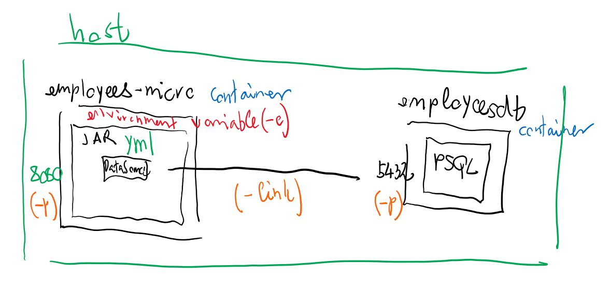

# Több alkalmazásból álló rendszerek

## Ajánlott irodalom

* Domain-Driven Design Distilled

## Tematika

* Igény az elosztott rendszerekre
* Történeti háttér (ad-hoc integrációk, fájl és adatbázis alapú integráció, EAI, SOA, microservices)
* EAI, p2p, hub-and-spoke
* SOA, BUS, business rule engine, orchestrator (BPEL)
* BPMN
	* https://www.jtechlog.hu/2014/07/25/pehelysulyu-workflow-activitivel.html
	* Egy előadásom az Activity-ről: https://www.youtube.com/watch?v=66FavTUB7AM
* Microservices
	* Martin Fowler definíció: https://martinfowler.com/articles/microservices.html
	* Red Hat bevezető videója: https://www.youtube.com/watch?v=WK3tbQCzVxg
	* Előfeltételek:
		* DDD
		* DevOps
		* Self-service, on-demand, elastic infrastructure as code (Immutable image), Kubernetes
		* Automatizáció
		* CI/CD
		* Deployment pipeline
		* Monitoring
		* Rollback, visszaállás
		* Blue/green deployment, canary testing
* Mono repo - multi repo

## Microservice-szel kapcsolatos gondolatok

Itt lettek rögzítve a mgfogalmazott előnyöket és kételyeket.

* Több különálló alkalmazás, mely külön deployolható, skálázható
* Ha sok release van, hogyan történhet ennek összehangolása
* Hogyan akadályozható meg, hogy spagetti architektúra jöjjön létre?
* Fejlesztés közben hogyan valósítható meg, hogy minden függőség elinduljon?
* Hype
* Amit nyerünk a fejlesztésen, vesztünk az üzemeltetésen
* Hogy néz ki ez Java EE környezetben?
* Hogyan néz ki egy service-eken átnyúló módosítás fejlesztése?
* Mi kerüljön egy repo-ba, és mi külön?
* Jól definiált interfészek, kevesebb mellékhatás, jól definiált felelősségi körök
* Adott problémára a megfelelő eszköz választható
* Redundancia/magas rendelkezésre állás/skálázódás finomabban implementálható

## Twelve-factor app

* [Twelve-factor app](https://12factor.net/) egy manifesztó, metodológia felhőbe telepíthető alkalmazások fejlesztésére
* Heroku platform fejlesztőinek ajánlása
* Előtérben a cloud, PaaS, continuous deployment
* PaaS: elrejti az infrastruktúra részleteit
    * Pl. Google App Engine, Redhat Open Shift, Pivotal Cloud Foundry, Heroku, AppHarbor, Amazon AWS, stb.

## Cloud native

* Jelző olyan szervezetekre, melyek képesek az automatizálás előnyeit kihasználva gyorsabban megbízható és skálázható alkalmazásokat szállítani
* Pivotal, többek között a Spring mögött álló cég
* Előtérben a continuous delivery, DevOps, microservices
* Alkalmazás jellemzői
    * PaaS-on fut (cloud)
    * Elastic: automatikus horizontális skálázódás

## Twelve-factor app ajánlások

* Verziókezelés: "One codebase tracked in revision control, many deploys"
* Függőségek: "Explicitly declare and isolate dependencies"
* Konfiguráció: "Store config in the environment"
* Háttérszolgáltatások: "Treat backing services as attached resources"
* Build, release, futtatás: "Strictly separate build and run stages"
* Folyamatok: "Execute the app as one or more stateless processes"
* Port hozzárendelés: "Export services via port binding"
* Párhuzamosság: "Scale out via the process model"
* Disposability: "Maximize robustness with fast startup and graceful shutdown"
* Éles és fejlesztői környezet hasonlósága: "Keep development, staging, and production as similar as possible"
* Naplózás: "Treat logs as event streams"
* Felügyeleti folyamatok: "Run admin/management tasks as one-off processes"

## Beyond the Twelve-Factor App

* One Codebase, One Application
* API first
* Dependency Management
* Design, Build, Release, Run
* Configuration, Credentials and Code
* Logs
* Disposability
* Backing services
* Environment Parity
* Administrative Processes
* Port Binding
* Stateless Processes
* Concurrency
* Telemetry
* Authentication and Authorization

## Házi feladat

Nézzük meg, hogy a Java EE világban hogyan gondolják a microservice-ek implementálását.

Thorntail egy megoldás arra, hogy microservice-eket fejlesszünk, de Java EE technológiák használatával.
JBoss fejleszti, régebben WildFly Swarm volt a neve (ezt gyakran láthatjuk a stacktrace-ben).
Microprofile implementáció. Az [Eclipse Microprofile](https://projects.eclipse.org/projects/technology.microprofile) egy szabvány
ugyanerre, melynek több implementációja van. Másik ismertebb a [Quarkus](https://quarkus.io/).

A szabvány további részei:

* Metrics
* Health Check
* Fault Tolerance
* MicroProfile Config
* Rest Client

Portoljuk a `employees` könyvtárban található alkalmazásunkat Throntailre! Ha gondolod, egy egyszerű
saját alkalmazást is fejleszthetsz, egy entitással, DAO, service és REST réteggel.

Használt technológiák:

* Lombok - getter/setter, konstruktor generáláshoz
* MapStruct - entity - dto konvertáláshoz (elhagyható vagy más választható)
* Java EE/CDI - dependency injection
* Java EE/JAXB - JSON mappeléshez
* Flyway - adatbázis séma inicializáció
* Java EE/JPA - ORM
* DeltaSpike Data - DAO generáláshoz (elhagyható)

Induljunk ki abból, hogy a projekt vázát lehet generálni a [Generatorral](https://thorntail.io/generator/).
Legyen a `groupId` `training.architect`, az `artifactId` `employees-micro`. Válasszuk ki a következő
függőségeket: CDI, JPA (with Hibernate and H2), Flyway, JAX-RS with JAX-B.

A `mvn clean package thorntail:run` parancsot kiadva az alkalmazás elérhető a `http://localhost:8080/hello` címen.
Nézzük át a forráskódját!

IntelliJ IDEA-ban Run configurationnél kell felvenni, hogy Maven parancsot indítson.

A Java 13 verzióval dolgozz, a 14-es a következő hibát dobta:

```
java.lang.IllegalArgumentException: Unsupported class file major version 58
```

Következő függőségek kellenek még:

```xml
<dependency>
	<groupId>org.postgresql</groupId>
	<artifactId>postgresql</artifactId>
	<version>${version.postgresql}</version>
</dependency>

<dependency>
	<groupId>org.projectlombok</groupId>
	<artifactId>lombok</artifactId>
	<scope>provided</scope>
	<version>${lombok.version}</version>
</dependency>

<dependency>
	<groupId>org.mapstruct</groupId>
	<artifactId>mapstruct</artifactId>
	<version>${mapstruct.version}</version>
</dependency>

<dependency>
	<groupId>org.apache.deltaspike.modules</groupId>
	<artifactId>deltaspike-data-module-api</artifactId>
	<version>${deltaspike.version}</version>
	<scope>compile</scope>
</dependency>

<dependency>
	<groupId>org.apache.deltaspike.modules</groupId>
	<artifactId>deltaspike-data-module-impl</artifactId>
	<version>${deltaspike.version}</version>
	<scope>runtime</scope>
</dependency>
```

A `pom.xml`-be vedd fel, hogy a Lombok és a MapStruct egymás mellett tudjon dolgozni:

```xml
<plugin>
	<groupId>org.apache.maven.plugins</groupId>
	<artifactId>maven-compiler-plugin</artifactId>
	<version>3.8.1</version>
	<configuration>
		<annotationProcessorPaths>
			<path>
				<groupId>org.projectlombok</groupId>
				<artifactId>lombok</artifactId>
				<version>${lombok.version}</version>
			</path>
			<path>
				<groupId>org.mapstruct</groupId>
				<artifactId>mapstruct-processor</artifactId>
				<version>${mapstruct.version}</version>
			</path>
		</annotationProcessorPaths>
	</configuration>
</plugin>
```

A `DbMigrator.java` törölhető, ugyanis a Thorntail automatikusan érzékeli a Flyway-t,
és konfigurálja.

Azonban a DataSource neve problémás. A Thorntail a környezeti paramétereket automatikusan kisbetűsíti,
és nem lehet neki megmondani, hogy case-sensitive legyen. Ezért a DataSource neve legyen
pl. `employeesds`, erre hivatkozni a `persistence.xml` állományban kell:

```xml
<jta-data-source>jboss/datasources/employeesds</jta-data-source>
```

Definiálni az `src/main/resources/project-defaults.yml` fájlban kell.

```yml
thorntail:
  datasources:
    data-sources:
      employeesds:
        driver-name: postgresql
        connection-url: jdbc:postgresql:postgres
        user-name: postgres
        password: mysecretpassword
```

Ez alapján a Thorntail inicializálja a drivert is.

A többi teljesen megegyezik az eredeti alkalmazással. Az önmagában indítható alkalmazás
`target/employees-micro-thorntail.jar` fájlként jelenik meg. Ezt szépen lehet a
`java -jar employees-micro-thorntail.jar` paranccsal futtatni.

Nektek mekkora lett a fájl?

Indítsd el az alkalmazást Docker konténerben. Ehhez először adatbázis kell.
Ezt indítsd el Docker konténerben a következő paranccsal:

```
docker run --name employeesdb -e POSTGRES_PASSWORD=mysecretpassword -d -p 5432:5432 postgres
```

Majd hozz létre egy `Dockerfile` fájlt a projekt gyökérkönyvtárában a következő
tartalommal:

```
FROM adoptopenjdk:13-jre-hotspot

RUN mkdir /opt/app
ADD target/employees-micro-thorntail.jar /opt/app/employees.jar
CMD ["ulimit", "-n", "8192"]
CMD ["java", "-Djava.net.preferIPv4Stack=true", "-Djava.net.preferIPv4Addresses=true", "-jar", "/opt/app/employees.jar"]
```

A `preferIPv4Stack` hiányakor protokollra vonatkozó hibát dobott. A 14-es Java esetén zip fájlt nem tudott
kitömöríteni, és a fenti hibát dobta. Az `ulimit` is a zip fájlos hiba miatt kerülr bele.

Majd a következő paranccsal hozzuk létre az image-t a projekt gyökérkönyvtárában:

```
docker build -t employees-micro .
```

Majd indítsuk el az image-t:

```
docker run -d --name employees-micro -p 8088:8080 --link employeesdb:employeesdb -e THORNTAIL.DATASOURCES.DATA_DASH_SOURCES.EMPLOYEESDS.CONNECTION_DASH_URL=jdbc:postgresql://employeesdb/postgres employees-micro
```

Látható, hogy a parancsban az `employeesdb` konténert belinkeljük a `employeesdb` hostnévre, tehát ezen fogja elérni az alkalmazás konténere a másik konténert.
A `-e` kapcsolóval felülírjuk a `project-defaults.yml` fájl tartalmát, hogy ne `localhost`-hoz, hanem a `employeesdb` nevű szerverhez kapcsolódjon az alkalmazás.
A konténer `8080`-as portját kihozzuk a host 8080-as portjára, így elérhetjük a `http://localhost:8080/api/employees` címen.


